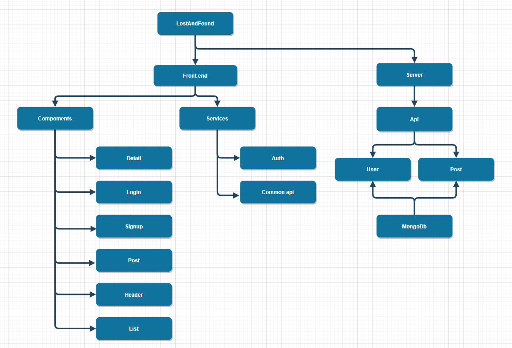

# LostAndFound

## Team Members

| Name        | Email                        | Role                               | Photo |
| ----------- | ---------------------------- | ---------------------------------- | ----- |
| Jiangqi Lou | bruce.lou.2020@bristol.ac.uk | Front-end and Back-end Development |       |
| Ruiqing Du  | bx20728@bristol.ac.uk        | Report writing                     |       |
| Ying Duan   | if20741@bristol.ac.uk        | Report writing                     |       |
|             |                              |                                    |       |
|             |                              |                                    |       |

## 1. Introduction
### 1.1 Abstract
The forum is a lost and found system. The system is designed to help teachers and students who have lost personal items near the Bristol campus.
The establishment of the campus lost and found system is to pick up information through the entry and publication of the lost items, in order to facilitate the owner of their lost items inquiry, once the inquiry to their lost items, the owner can get the contact information from the system, in order to facilitate the retrieval of their lost items.

### 1.2 Project Objectives
1. Collect, input and store the lost property information of the owner, the information of the picker and the contact information of the owner and the picker in time.
2. Query function of item information.
3. Regularly update the item information and cancel the records of the retrieved items.
4. Login and signup system for the users and the administrators of the forum.

### 1.3 Project presentation video

## 2. Background and Motivation
### 2.1 Background of the project
With the progress of society and the development of economy, people's education level has been continuously improved, the scope of popularization has been more and more wide, and the moral cultivation and quality of the public have been continuously improved. In today's information age, the fast pace of life makes people often lose something in life, which brings economic and spiritual loss to people. Nowadays, with the improvement of people's moral quality, people are more willing to return the lost property through some means and methods. At the same time, they are also looking for some channels and methods to recover the lost property. Lost and found is a common problem, the use of traditional manual registration management and paper manual management of lost and found, management and return is a huge workload, the work of the complex work, can not keep up with people's fast pace of life requirements. Along with the advancement of information construction of colleges and universities, many colleges and universities have to students, teachers, and related services to the means of informatization, such as the current commonly used IC card system, education system, employment system, the recruitment of students employment system, community management system and so on, but in view of the colleges and universities under the environment of the lost and found platform application is not universal. In the context of building a harmonious society, the quality of students is constantly improving, in the campus to promote the return of lost property is a kind of encouragement and spur to students. By establishing a lost-and-found platform in colleges and universities, on the one hand, students' unnecessary losses can be reduced to a certain extent. On the other hand, more students can get involved and praise those who give back without hesitation, which will bring positive energy to students and make campus culture more smooth and harmonious.
### 2.2 Current industry review
The lost and found system in many areas or institutions has been developed for a period of time, and has established each of the characteristics of the lost and found management system, for different items, different use environment, different user groups and so on.

For the lost and found the system construction is relatively early, invest more, the more successful cases is America's Missing Money website (http://www.missingmoney.com).
Users can search personal lost articles through the account login system, and the lost articles are the use of information management, the establishment of a complete lost articles database, the management efficiency of lost articles is very high.
China also attaches great importance to the construction of the lost and found system and has made some achievements in its construction and promotion. For example, the "missing object notice network":(http://www.xunwuqishi.com).

Through the understanding and analysis of some lost-and-found platforms, it can be seen that both domestic and foreign lost-and-found work has achieved certain results, and the target groups and coverage scope are also very broad, but the pertinence is slightly biased. Therefore, it is very necessary to build a targeted and fully functional lost-and-found system for Bristol university.
## 3. System Implementation
### 3.1 Stack architecture and system design
Diagram of the lost and found system

### 3.2 Back end implementation

### 3.3 Middle Tier implementation

### 3.4 Front End implementation

### 3.5 Deployment details

## 4. UX Design
### 4.1 Design Process and Early prototyping and ideation

### 4.2 Identification of interacting users

### 4.3 UX approach

### 4.4 Interaction flow diagrams for final key subsystems

## 5. Sprints & Project Management

### 5.1 Group working methods used and team roles

### 5.2 Team use of Git and documentation of the sprints

## 6. Evaluation
### 6.1 Techniques used & awareness of their limitations

### 6.2 Testing

## 7. Conclusion
### 7.1 Project conclusion

### 7.2 Future work
