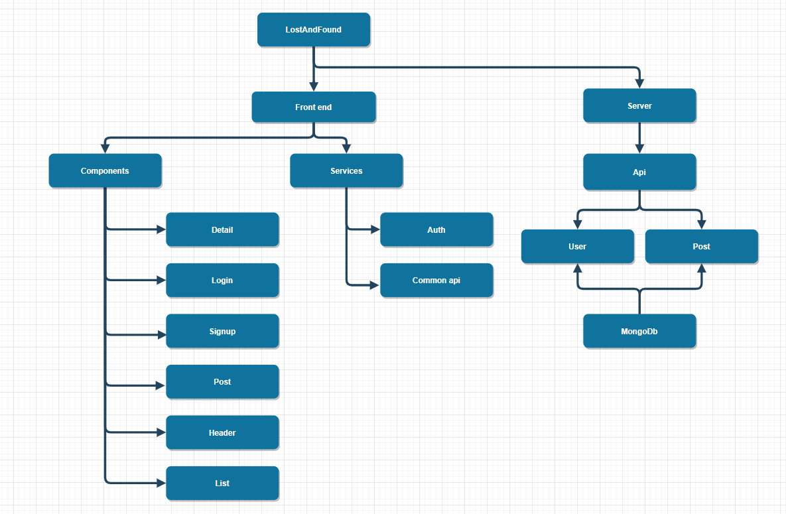

# LostAndFound

## Run instructions
1. npm install
2. ng build
3. docker-compose up --build
4. access (http://localhost:3000)

## Team Members

| Name        | Email                        | Role                               | Photo |
| ----------- | ---------------------------- | ---------------------------------- | ----- |
| Jiangqi Lou | bruce.lou.2020@bristol.ac.uk | Front-end and Back-end Development |       |
| Ruiqing Du  | bx20728@bristol.ac.uk        | Report writing                     |       |
| Ying Duan   | if20741@bristol.ac.uk        | Report writing                     |       |
| Hao Fu      | si20170@bristol.ac.uk        |                                    |       |
|             |                              |                                    |       |

## 1. Introduction
### 1.1 Abstract
The forum is a lost and found system. The system is designed to help teachers and students who have lost personal items near the Bristol campus.
The establishment of the campus lost and found system is to pick up information through the entry and publication of the lost items, in order to facilitate the owner of their lost items inquiry, once the inquiry to their lost items, the owner can get the contact information from the system, in order to facilitate the retrieval of their lost items.

### 1.2 Project Objectives
1. Collect, input and store the lost property information of the owner, the information of the picker and the contact information of the owner and the picker in time.
2. Query function of item information.
3. Regularly update the item information and cancel the records of the retrieved items.
4. Login and signup system for the users and the administrators of the forum.

### 1.3 Project presentation video

## 2. Background and Motivation
### 2.1 Background of the project
With the progress of society and the development of economy, people's education level has been continuously improved, the scope of popularization has been more and more wide, and the moral cultivation and quality of the public have been continuously improved. In today's information age, the fast pace of life makes people often lose something in life, which brings economic and spiritual loss to people. Nowadays, with the improvement of people's moral quality, people are more willing to return the lost property through some means and methods. At the same time, they are also looking for some channels and methods to recover the lost property. Lost and found is a common problem, the use of traditional manual registration management and paper manual management of lost and found, management and return is a huge workload, the work of the complex work, can not keep up with people's fast pace of life requirements. Along with the advancement of information construction of colleges and universities, many colleges and universities have to students, teachers, and related services to the means of informatization, such as the current commonly used IC card system, education system, employment system, the recruitment of students employment system, community management system and so on, but in view of the colleges and universities under the environment of the lost and found platform application is not universal. In the context of building a harmonious society, the quality of students is constantly improving, in the campus to promote the return of lost property is a kind of encouragement and spur to students. By establishing a lost-and-found platform in colleges and universities, on the one hand, students' unnecessary losses can be reduced to a certain extent. On the other hand, more students can get involved and praise those who give back without hesitation, which will bring positive energy to students and make campus culture more smooth and harmonious.
### 2.2 Current industry review
The lost and found system in many areas or institutions has been developed for a period of time, and has established each of the characteristics of the lost and found management system, for different items, different use environment, different user groups and so on.

For the lost and found the system construction is relatively early, invest more, the more successful cases is America's Missing Money website (http://www.missingmoney.com).
Users can search personal lost articles through the account login system, and the lost articles are the use of information management, the establishment of a complete lost articles database, the management efficiency of lost articles is very high.
China also attaches great importance to the construction of the lost and found system and has made some achievements in its construction and promotion. For example, the "missing object notice network":(http://www.xunwuqishi.com).

Through the understanding and analysis of some lost-and-found platforms, it can be seen that both domestic and foreign lost-and-found work has achieved certain results, and the target groups and coverage scope are also very broad, but the pertinence is slightly biased. Therefore, it is very necessary to build a targeted and fully functional lost-and-found system for Bristol university.
## 3. System Implementation
### 3.1 Stack architecture and system design
Diagram of the lost and found system:

The whole system is divided into 2 parts, the front end part and the server part.
The front end part contains the components and the services. The components are used to display different content of the website and the services are used to communicate with the server api.
The server part has two apis. The user api is to manage the login and signup function of the application and the post api is to manage the message and comment function of the system.
Both of the them can connect to the mongo database to access the user data and the post data stored in the database.

### 3.2 Back end implementation
Database used: MongoDb 
Backend database models:
1. Post model: post title, post content, username of the writer, comments, post create time, post update time.
2. User model: username and password.

### 3.3 Middle Tier implementation
The server side use nodejs, express as the server. There are two apis:
- Post api:
1. Get the add post request and save the post into database post model.
2. Get the post list and send data to the front end.
3. Get the post detail and send data to the front end.
4. Get the add comment request and update data.
5. Get the delete request and delete the post.
- User api:
1. Get the signup request and save the user information into database user model. If user exist, return error message.
2. Get the login request and compare with the user data in the database. If the data matched, return the success response, else, return the error message.

### 3.4 Front End implementation
Front end used: Angular 
Components:
1. Detail component: Display the post detail information, include post title, post body, comments, comment time, post delete button and comment submit button.
2. Header component: Display the top navigation link in the home page, when the user has not logged in, display the login and signup button, else, display the logged username and logout button. 
3. List component: Display the posts on the home page, limit to 8 posts per page.
4. Login component: Display the form for user to login. If the user does not type in the valid information, the warning message will appear.
5. Signup component: Display the form for user to register. User need to type in the username, password and repeat password. If the user does not type in the valid information, the warning message will appear.
6. Post component: Display the input box for user to write the post and comment. The input box contain the post title and post content.
### 3.5 Deployment details
The lost and found system use docker to achieve the continuous integration and deployment.
The detail configuration are contained in the Dockerfile and the docker-compose.yml file.
Docker create the nodejs image and db image, expose port 3000 to connect to the server.

## 4. UX Design
### 4.1 Design Process and Early prototyping and ideation

### 4.2 Identification of interacting users

### 4.3 UX approach

### 4.4 Interaction flow diagrams for final key subsystems

## 5. Sprints & Project Management

### 5.1 Group working methods used and team roles
The members of our team have formed a very good cooperation in this project. Everyone in the team is responsible for a part of the overall project. Among them, Jiangqi Lou guided the team very well. He provided vital and valuable experience for our team during the overall design and planning of the system. The remaining four members also assist Jiangqi Lou's work well.

In our daily work, we create, delete and manage various issues under "Projects" on the GitHub board. The phased work results of each team member can be viewed through GitHub. Our main communication channel is WeChat. We realize that we usually have limited time to communicate through Microsoft Teams in class, so we choose to communicate at any time through WeChat. For some related questions, team members can also reply at any time via WeChat. When performing agile sprints, the frequency of meetings with group members through WeChat changed from twice a week to four times a week. Therefore, the work efficiency of our team is relatively high. In short, this is a good online collaboration experience.

### 5.2 Team use of Git and documentation of the sprints

## 6. Evaluation
### 6.1 Techniques used & awareness of their limitations

We use the MEAN stack to build our application. MEAN represents the emergence of JavaScript as a "full-stack development" language that runs everything in the application from the front-end to the back-end. Each abbreviation in MEAN represents a component in the stack:
• MongoDB: A database server that uses JSON (JavaScript Object Notation) to query and store data structures in binary JSON format
• Express: server-side JavaScript framework
• Angular: client-side JavaScript framework
• Node.js: JavaScript runtime

As for limitations:
1. You need experts: The MEAN technology stack has many "limitations" and errors. You need to understand these errors and errors to avoid errors. For example, Angular has many limitations (even though some of these problems have been solved in Angular 2). The same goes for MongoDB and other technologies in the stack. This also brings up the next big problem:
2. Hard to find experts: You will have a hard time finding developers who are strong in these new technologies. For example, we tried to find a strong Angular developer from around and let him answer the questions in our application. It's really hard. Therefore, it is still necessary to rely on entry-level programmers on these technologies and try to make them learn these technologies quickly in some way. But usually this cannot be solved well.
3. Not yet tried and tested: You may not find many answers to MEAN online questions. Some technologies are so new that there is only a small online community discussing problems that may arise during the development process.

### 6.2 Testing
The test work of the Lost and Found Management System for university of Bristol is mainly designed to find the defects in the function and performance of the lost and found system, and to modify the system in time after the test, to ensure the smooth on-line of the system, and ensure that users have a good use experience in the process of use, and feel the convenience of the system.

This system adopts the way of functional testing. The following will present each functional test case and test result of the system in the form of table, and explain and analyze it.

| Test name        | Test procedure          | Expected results                   | Actual results |
| ----------- | ---------------------------- | ---------------------------------- | ----- |
| User login information validation | Compare the user login information with the imported information in the system | Verify user login information successfully and display status| Achieve desired effect  |
| User register information validation  | Compare the user register information with the imported information in the system        | User login information successfully saved in the database and can used to log in   | Achieve desired effect      |
| User log out   | Click the log out button, check if the log in state become unlogged in        | User successfully logged out and clear the user token      |  Achieve desired effect     |
| Lost and found information released      | User log in and post information in the Lost and Found website       |  The published information will be displayed on the page after successful publication                                  |   Achieve desired effect    |
| Reply function for the lost item post   | User log in and add reply in the detail page of a lost item post                             | The reply will be displayed on the detail page after successful publication                                   |  Achieve desired effect     |

## 7. Conclusion
### 7.1 Project conclusion

### 7.2 Future work
In this system research, development, implementation process due to personal ability is limited, consider the problem is not comprehensive enough so that the system in the design and implementation of some deficiencies, these deficiencies will be improved in the follow-up practice.

1. The system is not clear enough about the user information management and classification authority.

2. The current system only achieves the desktop application, does not realize the mobile client, this can be developed in subsequent work.

3. Need to enhance the data statistics, classification search function, so that users more convenient use of the system.
